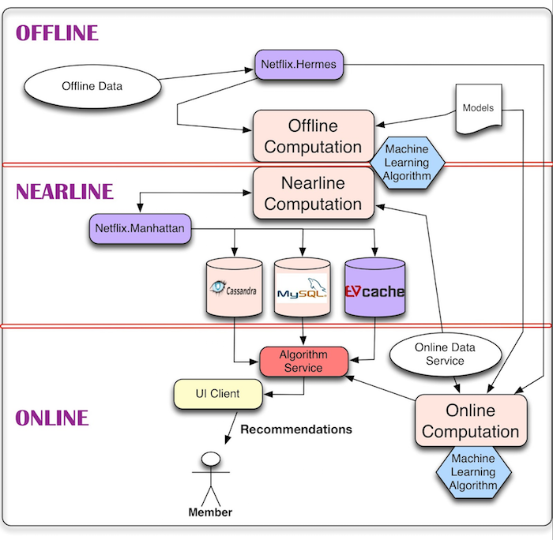

##PROJECT 4: ACCURACY AND BEYOND  

```{r, message=FALSE}
library(recommenderlab)
```  

###DATA LOAD & PREPARATION   

For this week's project, the `jester` dataset will be used. This ratings data was chosen due to the lack of sparsity in the data, and the relative ease at which it can be coerced into the proprietary `realRatingsMatrix` format for use with recommenderlab.  

####Load Data  

The Jester joke ratings are supplied in Excel file format (http://goldberg.berkeley.edu/jester-data/), which was converted using the same program. The joke ratings matrix contains 23,500 users who have rated at least 36 of the 100 jokes. The first column is a count of how many jokes were rated, and each subsequent column represents a joke, therefore the first column is removed from the dataframe. Users are represented by the rows, and neither the users or jokes are labeled in the dataframe. Instead of `NA` values, jokes that have not been rated are indicated with a value of 99, these will be converted before moving forward.  

```{r load_jester}
jester <- read.csv("./jester-data-2.csv", header=FALSE, stringsAsFactors = FALSE)

jester <- jester[ , -1]  # remove 1st col, contains no. jokes rated
jester[jester==99] <- NA  # set 99s to NA
```  

Since this subset contains users who have rated no less than 36 jokes each, the sparsity of the matrix should not be that bad. The results below show that 641,007 of the user/item combinations contain an `NA` value (~27%).  

```{r jester_sparsity}
table(is.na(jester))
```  

####Create Real Rating Matrix

In the interest of saving computational time, a smaller subset of the overall dataframe is taken by sampling 25% of the rows without replacement. This sampled dataframe is then converted to a matrix, and then coerced into the realRatingMatrix format.  

```{r create_rrm}
jstr_samp <- jester[sample.int(nrow(jester), 5875, replace=FALSE), ]  

jstr_mat <- as.matrix(jstr_samp)
jstr_rrm <- as(jstr_mat, "realRatingMatrix")
jstr_rrm
```  

below is a visualization of the first 20 users ratings of jokes 1:50. The white spaces indicate unrated jokes, the red cells positively rated jokes, and the blue cells negatively rated jokes.  

```{r ratings_viz}
image(jstr_rrm[1:20, 1:50], "Jester Sampled Ratings Matrix")
```  

The distribution of ratings is below:  

```{r joke_dist}
hist(getRatings(jstr_rrm), col="turquoise3", main="Distribution of Joke Ratings", xlab="Joke Rating")
```  

Examining the histogram, the jokes in the sample set are mostly given a positive rating, with the number of items rated highly positive tapering off. Again, this is the same pattern that we have seen with other media ratings - a left-skewed, mostly normal distribution.  

In comparing the recommendation algorithms in the next section, the default distribution will be used, instead of normalizing the ratings by centering or using the z-score.  

###Recommender Algorithms  

For the purposes of comparing different recommendation algorithms with the Jester joke ratings, one evaluation scheme will be created, and fed into four different recommendation algorithms.  

```{r eval_scheme}
e <- evaluationScheme(jstr_rrm, method="split", train=0.8, k=1, given=10, goodRating=1 )
```  

For the purposes of part 1. of the project, item- and user-based collaborative filtering are included. For part 2., the `RANDOM` and `POPULAR` algorithms are used for the purposes of introducing serendipity and novelty.  

```{r rec_objs}
ubcf_rec <- Recommender(getData(e, "train"), "UBCF")
ibcf_rec <- Recommender(getData(e, "train"), "IBCF")
rand_rec <- Recommender(getData(e, "train"), "RANDOM")
pop_rec <- Recommender(getData(e, "train"), "POPULAR")
```  

The recommender objects of the appropriate types are then fed into `recommenderlab`'s `predict` function:  

```{r predict}
ubcf_pred <- predict(ubcf_rec, getData(e, "known"), type="ratings")
ibcf_pred <- predict(ibcf_rec, getData(e, "known"), type="ratings")
rand_pred <- predict(rand_rec, getData(e, "known"), type="ratings")
pop_pred <- predict(pop_rec, getData(e, "known"), type="ratings")
```  

###Prediction Accuracy  

Finally, the prediction accuracy of each algorithm is calculated.

```{r errors}
errs <- rbind(
  ubcf = calcPredictionAccuracy(ubcf_pred, getData(e, "unknown")), 
  ibcf = calcPredictionAccuracy(ibcf_pred, getData(e, "unknown")), 
  rand = calcPredictionAccuracy(rand_pred, getData(e, "unknown")), 
  pop = calcPredictionAccuracy(pop_pred, getData(e, "unknown"))
)
errs
```  

All of the above filtering models were run without additional parameters for normalizing or similarity metrics (cosine distance, pearson correlation), simply to see the "base" results. 

The models with the lowest measures of accuracy metrics are user-based collaborative filtering and the recommendations based on popular items. For the latter, even though the recommendations are more accurate, they will lack an serendipity or variety due to the fact that the most often rated (and generally better rated) items are recommended. This seems to be the case in the difference between user- and item-based collaborative filtering, as one can presume that there are greater differences in the number and variety of items (the long-tail!), than there are differences in the interests of users.  

In terms of sernedipty or diversity, the `RANDOM` algorithm was used, which shows the trade-off in accuracy with the lowest metrics, but will allow for items that may not necessarily be recommended (on the fringes of similarity of other users/items) with some of the other algorithms to be shown to users.  

###Plots  

For further evaluation, plotting of ROC curves and precision/recall relationships can be created by using `recommenderlab`'s `evaluate` function. A list of the algoritms used above is fed into the function, along with a list of the number of "top N" recommendations to consider.  

```{r algrthm_lst}
algorithms <- list("Random Items" = list(name="RANDOM", param=NULL),
                   "Pop. Items" = list(name="POPULAR", param=NULL),
                   "UBCF"= list(name="UBCF", param=list(nn=50)),
                   "IBCF"= list(name="IBCF", param=list(k=50))
                   )

results <- evaluate(e, algorithms, type = "topNList", n=c(1, 5, 10, 20, 30, 50))
```  

####Precision/Recall  

```{r prec_recall}
plot(results, "prec/rec", annotate=c(1,3), legend="bottomright")
```  

The chart above illustrates the relationship between precision (ratio of false positives to all positives, true or false), and recall (percent of items taken that were recommended). The trade-off between precision and recall is as expected with the two higher performing algorithms (Popular Items and UBCF), however the IBCF and Random algorithms have almost no trade-off between precision and recall with a greater number of items recommended.  

Next, the Receiver Operating Characteristic (ROC) curve is plotted for all four algorithms:  

```{r roc_curves}
plot(results, "ROC", annotate=c(4, 3))
```  

The ROC curve above shows the relationship between the True Positive and False Positive Rate.  Since the IBCF and Random Items follow an almost diagonal line, these tests are not accurate, which we know from the above results. However, given the shape of the curve for the other algorithms, there is room for improvement in the recommendation results. 

If the goal was to create the most accurate recommendation engine, we would most likely use the user-based collaborative filtering, and experiment with normalization, binarizing, or other techniques to improve the accuracy. Likewise, if we wanted to trade off accuracy for some randomness, one of the other two algorithms could be selected, but also improved upon, as the current setup would probably not yield acceptable results.  

###Only Online Evaluation  

All of the experiments and various algorithms implemented so far have been for *offline* accuracy. These are for predictions made using a log or already-existing record of ratings given without the recommender engine being used.  For an online system, the accuracy would be measured by the recommender engine being present, predicting or recommending an item, link, story, etc. and then the user views it, and perhaps even orders (downloads, purchases, click-through) the recommended item. 

So in theory, there are two parts to measure the success of the online recommendation system: the click-through rate for interest in the item, and the follow-through of consuming the item.  In order to test the accuracy of an online recommendation system, A/B testing would be utilized, where one set of users is recommended items by system "A", and another set of users using system "B".  The one with the higher click-through rate would be deemed the better system.  

One "sketch" of how this type of system would be set up would be using a database (SQL or NoSQL) to store the training data (past results or existing ratings), some kind of computational system to run and update the algorithms in real time, and some kind of GUI to present the choices and recommendations to the end-user.  

The following image from the [Netflix Technology Blog](https://medium.com/netflix-techblog/system-architectures-for-personalization-and-recommendation-e081aa94b5d8) illustrates the concepts of the offline and online concepts needed for a robust recommendation system quite well:  




